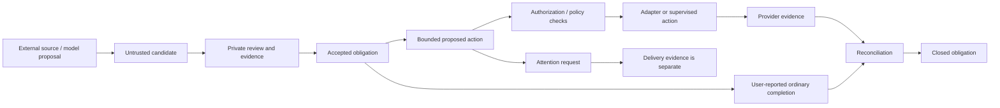

# Kintsugi JARVIS

### A reminder sent is not a job done.

A governed household-agent research prototype that separates **obligations,
software actions, and evidence of completion**. Built to reduce administrative
burden without turning a language model's confidence into authority.

**Robert King · AI-assisted systems design · Public research/portfolio edition 1.0**

[Read the case study](docs/CASE_STUDY.md) · [Reproduce the results](docs/REPRODUCIBILITY.md) ·
[Inspect the architecture](docs/ARCHITECTURE.md) · [Known limits](docs/LIMITATIONS.md) ·
[Browse the portfolio page](site/index.html)

> **Release status:** locally tested reference software, plus separately labeled
> operator-reported Google Workspace calibration. Not a production service,
> unattended banking agent, certified safety system, or globally enforced broker.

## Why this exists

A household assistant can successfully create a task and still fail the person:
the notification may never arrive, the task may be a duplicate, or clearing the
reminder may be mistaken for doing the underlying work. Kintsugi treats those as
separate engineering questions, not conversational details.

The project developed through three complementary tracks:

| Track | Included | Important boundary |
|---|---|---|
| [Private household application](components/household) | Routines, minimum mode, Done/Undo/Snooze, private state, local supervisor, bounded adapters | Live account and phone deployment remain separately gated. |
| [Delivery bridge](components/bridge) | Bounded candidate contracts, durable queue, leases, acknowledgement, duplicate handling, local monitor | Offline reference only: no production OAuth, MCP listener, or public gateway. |
| [Spark-native methodology](skills/kintsugi-jarvis-core) | Importable reasoning skill and synthetic calibration exercises | Instructions influence behavior; they do not enforce permissions or guarantee selection. |

## The engineering result

The public-source verification reruns **311 household tests and 158 bridge tests**.
These are two suites, not 469 independently proven security properties. Generated
mutation/sequence iterations are reported separately inside their parent tests.
See the [machine-readable evidence](evidence/reference/README.md) for exact scope,
environment, individual test outcomes, and the remaining live checks.

The field calibration found useful behavior in selected Spark/Keep/Tasks workflows:
state creation, update, no-op, duplicate ambiguity, human-edit preservation, and
obligation closure. It also found a decisive unresolved failure: **some background-created
timed tasks did not produce a phone notification, even though the task existed.**
Manual editing was followed by successful delivery in a reported trial. The cause
was not established; neither a longer lead time nor a two-step create/update
procedure established a reliable fix. [Field record](docs/FIELD_CALIBRATION.md)

That failure is part of the product evidence, not hidden in a footnote.

## Five-minute offline review

Use an existing Python 3.11+ with an IANA timezone database. No API key, paid model,
Pi, account connection, or dependency installation is needed for the default tests.
Commands below use temporary synthetic state and do not install a service.

```bash
python tools/verify_manifest.py
python tools/reproduce.py --out local-evidence
python tools/demo.py
```

On Windows use `py -3` if that is your installed interpreter. If timezone data is
missing, the preflight stops with an explanation; it does not silently install it.

To examine the private local application, follow the separate
[household quickstart](components/household/00_START_HERE.md). Keep its state outside
this repository. The background runtime has no payment or calendar-writer HTTP
endpoint. The optional calendar operator is a separate, supervised lane.

## Design in one view



The native-Spark track and local-control track are **not automatically connected**.
A SQLite lock does not govern a separate cloud agent. A skill cannot grant a
permission, prove authentication, or guarantee a notification reached a phone.

## What to inspect first

- [Case study](docs/CASE_STUDY.md): problem, design choices, failures, repairs, and tradeoffs.
- [Threat model](docs/THREAT_MODEL.md): assets, boundaries, attacks, and residual risks.
- [Evidence and claims policy](docs/EVIDENCE_POLICY.md): code, simulated behavior, field reports, and untested ideas remain separate.
- [Notification incident](docs/NOTIFICATION_INCIDENT.md): why stored time is not delivery evidence.
- [Roadmap](docs/ROADMAP.md): practical acceptance gates, not a promise of unrestricted autonomy.

## Ownership and contribution

Robert King led the project and field calibration; AI assisted implementation and
analysis. See [NOTICE](NOTICE.md) for attribution, [SECURITY](SECURITY.md) for reporting,
and [CONTRIBUTING](CONTRIBUTING.md) for review rules. No open-source license has been
selected; see [LICENSE](LICENSE). No private account data or KT source is included.
